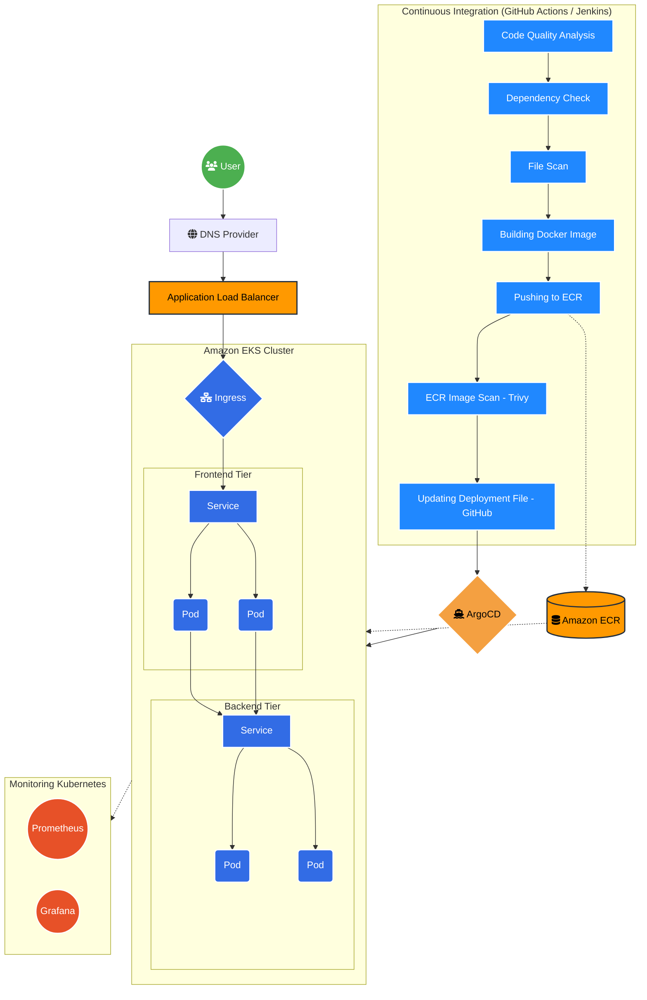

# 🚀 VTU Results Platform — DevSecOps & GitOps Architecture

Welcome to the **VTU Results** monorepo! This repository showcases a modern, enterprise-grade cloud-native architecture. We have fully migrated the backend and frontend into an **Amazon EKS (Elastic Kubernetes Service)** cluster using a robust **DevSecOps** and **GitOps** pipeline.

## 🏗️ Architecture Overview

Our infrastructure is entirely defined as code using Terraform and Kubernetes manifests, continuously delivered via ArgoCD.

### The Stack
- **Frontend**: Next.js (React)
- **Backend**: FastAPI (Python)
- **Infrastructure as Code (IaC)**: Terraform
- **Container Orchestration**: Amazon EKS (Kubernetes)
- **GitOps CD**: ArgoCD
- **CI/CD Pipelines**: GitHub Actions & Jenkins
- **Container Registry**: Amazon ECR
- **Routing & Networking**: AWS Application Load Balancer (ALB) Ingress Controller

---

## 🔄 DevSecOps & CI/CD Workflow

We enforce a strict separation of Continuous Integration (CI) and Continuous Deployment (CD) through a true GitOps model.

### 1. Continuous Integration (GitHub Actions)
Whenever a developer pushes code to the `main` branch (or opens a PR):
1. **Linting & Security Checks**: Python (Ruff) and Next.js linters run to verify code quality and catch security vulnerabilities early.
2. **Docker Build**: The application is containerized using Docker.
3. **Registry Push**: The new Docker image is tagged with the unique Git commit SHA and pushed to **Amazon ECR**.
4. **GitOps Manifest Update**: The pipeline uses `kustomize` to update the image tags in the `frontend/gitops/overlays/` directory and commits the new tags back to the repository.

### 2. Continuous Deployment (ArgoCD GitOps)
ArgoCD lives directly inside the EKS cluster and constantly monitors this repository. 
1. **Detection**: ArgoCD detects the new image tag commit made by GitHub Actions.
2. **Synchronization**: 
   - **Staging**: Automatically syncs and rolls out the new Deployment pods.
   - **Production**: Awaits a manual sync approval for safety.
3. **Reconciliation**: If anyone manually modifies the Kubernetes cluster, ArgoCD detects the drift and immediately overwrites the cluster state to match the Git repository.

---

## 🗺️ Monorepo Structure

```text
📦 Devops-VTU-RESULTS
 ┣ 📂 .github/workflows/        # CI pipelines (GitHub Actions)
 ┣ 📂 backend/                  # FastAPI Python Application
 ┃  ┣ 📂 app/                   # API logic & routes
 ┃  ┗ 📜 Dockerfile             # Backend container definition
 ┣ 📂 frontend/                 # Next.js React Application
 ┃  ┣ 📂 app/                   # UI components & pages
 ┃  ┣ 📂 infrastructure/        # Terraform IaC (EKS, ECR, VPC)
 ┃  ┣ 📂 gitops/                # Kubernetes Manifests for ArgoCD
 ┃  ┃  ┣ 📂 base/               # Base Kustomize manifests (Deployments, Services, HPA, Ingress)
 ┃  ┃  ┣ 📂 overlays/           # Env-specific configurations
 ┃  ┃  ┃  ┣ 📂 staging/         # Staging patches (Auto-sync)
 ┃  ┃  ┃  ┗ 📂 production/      # Production patches (Manual sync)
 ┃  ┃  ┗ 📂 argocd/             # ArgoCD Bootstrap scripts & CRDs
 ┃  ┗ 📜 Dockerfile             # Frontend container definition
 ┗ 📜 README.md                 # You are here!
```

---

## 🛠️ Kubernetes Configuration Highlights

- **Horizontal Pod Autoscaling (HPA)**: Both frontend and backend automatically scale their pod counts based on CPU and memory utilization.
- **Application Load Balancer (ALB)**: Traffic is routed into the cluster via an AWS ALB managed automatically by the AWS Load Balancer Controller.
- **Health Probes**: Liveness and Readiness probes ensure traffic is only routed to healthy pods. If a pod crashes, Kubernetes automatically restarts it.
- **Zero-Downtime Rolling Updates**: When ArgoCD deploys a new version, old pods are smoothly drained and terminated only after new pods become healthy.

---

## 🚀 Getting Started (Bootstrap)

To deploy this architecture from scratch:

1. **Infrastructure**: Navigate to `frontend/infrastructure/terraform` and run `terraform apply` to provision the VPC, EKS cluster, and ECR repositories.
2. **ArgoCD**: Authenticate to EKS via `aws eks update-kubeconfig`, then navigate to `frontend/gitops/argocd` and run `bash install.sh` to bootstrap the GitOps operator.
3. **Pipelines**: Trigger the GitHub Actions pipeline to build the initial images and update the Kustomize manifests. ArgoCD will take over from there!
